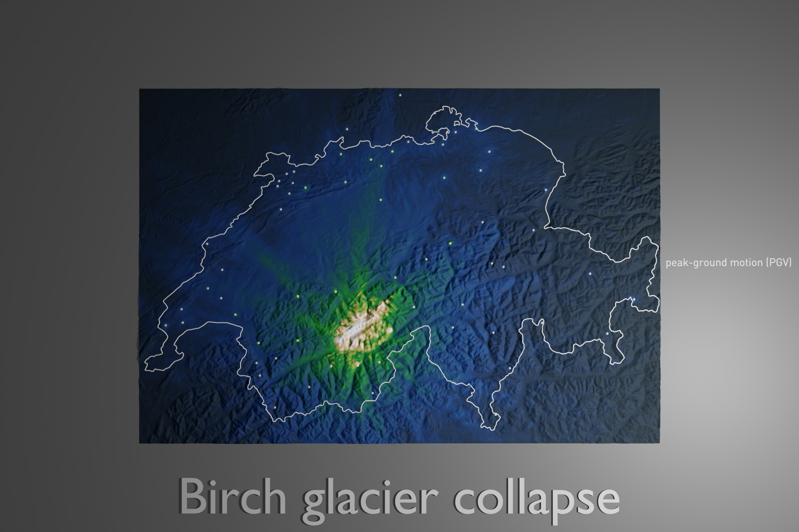

# Birch glacier collapse - time-reversal simulation

---



This example deals with the [Birch glacier collapse](https://eos.org/thelandslideblog/blatten-birch-glacier-5) in Switzerland from May 28th, 2025.
The simulation requires a few extra setup steps before running a time-reversal (adjoint) simulation:
- download data from the [Swiss broadband station network (CH)](http://seismo.ethz.ch/en/monitoring/national-seismic-network/)
  of the event to create the needed (adjoint) sources for the time-reversal simulation.
- convert a detailed velocity model from [Diehl et al. (2021)](https://agupubs.onlinelibrary.wiley.com/doi/full/10.1029/2021JB022155)
  as used by the [Swiss Seismological Service](http://seismo.ethz.ch/en/home/) to a SPECFEM3D tomography model file.
- create a mesh of Switzerland with topography and combined USGS Vs30 values.

All the needed setup scripts are provided in this example folder.

The injected wavefield at the stations will be time-reversed such that the simulation should pinpoint the source of the seismic energy.
For this example simulation, we will turn on parameters in `DATA/Par_file` to run a (pure) adjoint simulation (`SIMULATION_TYPE = 2`) and create movie (`MOVIE_SURFACE`) and shakemap (`CREATE_SHAKEMAP`) data files for a visualization.

About the event:
* The Birch glacier collapse and landslide occurred on May 28th, 2025, at around 15:24 local time (UTC 13:24).
  The Swiss Seismological Service locates the event at [46.40 N / 7.84 E](http://seismo.ethz.ch/en/earthquakes/switzerland/massmovementpage.html?originId=%27c21pOmNoLmV0aHouc2VkL3NjMjBhZy9PcmlnaW4vMjAyNTA1MjkxNjAwMjEuMzQ0ODE0LjEyNDU4Mg==%27&date_ch=2025-05-28&time_ch=15:24&region=Goppenstein%20VS&magnitude=3.1).

* seismic data:

  We will use broadband station data from the Swiss network as these stations show a good signal-to-noise ratio.
  See a [map of all network stations](https://stations.seismo.ethz.ch/en/station-information/station-map/) for their locations.

  The closest broadband station to the event is located at the Lauchernalp:
  [CH.LAUCH at 46.41554 N / 7.77166 E](https://stations.seismo.ethz.ch/en/station-information/station-details/station-given-networkcode-and-stationcode/index.html?networkcode=CH&stationcode=LAUCH).

  For the time-reversal simulation here, we will re-inject the station recordings for velocity, rather than displacement or acceleration.
  The decision for this is mostly based on some trial-and-error approach. Velocity seems to be a good trade-off between frequency content and
  wavefield coherency between stations.

  Broadband stations in general record velocity directly, whereas displacement will be integrated and acceleration taken as time derivate of the raw record.
  That is, displacement can exhibit long-period tilt and drift as artifacts due to integrating noise. On the other hand, acceleration can further enhance high-frequency noise.

  The frequency range of interest here for the collapse is similar to large landslides, with a peak of energy in the 1 - 10 Hz range.
  Noise at these high frequencies is likely generated closeby (e.g., natural wind/river and human induced),
  and thus uncorrelated between different stations. Velocity therefore seems to provide a good
  balance between frequency content and wavefield correlation for this type of time-reversal simulation.

  For the simulation here, we use a rather coarse mesh that is able to resolve
  frequencies up to about 1 Hz. The data will be processed with a rather low bandpass filter between 0.025 to 0.5 Hz, hoping that this further enhances the wavefield coherency between stations. We could increase the mesh resolution and data frequency content further, but for the visualization purpose here this is good enough.


## Step-by-step

1. Let's create a model for our target region, by using the setup script:
  ```
  $./setup_model.sh
  ```
  This will setup the topography and VS30 interfaces for our target region of Switzerland, and modify the `Par_file`, `Mesh_Par_file` and `interfaces.dat` with the corresponding mesh region and interface resolution required.


2. Here, we create a tomography velocity model based on the Diehl et al. (2021) model of Switzerland. The following script will download the original model files provided in this [ETHZ repository](https://www.research-collection.ethz.ch/handle/20.500.11850/453236), extract the original Vp and Vs model files (in SIMULPS14 format) and convert them to a SPECFEM3D tomography file in folder `Diehl_model/`:
    ```
     $ ./convert_Diehletal_to_SPECFEM.py Diehl_model/
     ```
     To use the converted tomography model as tomography model for the simulation, we copy it into our `DATA/` folder to match our `DATA/Par_file` setting:
     ```
     $ mkdir -p DATA/tomo_files/
     $ cp -v Diehl_model/tomography_model.* ../DATA/tomo_files/
     ```

3. Now, let's download data and prepare our (adjoint) sources for the time-reversal simulation. There are two scripts provided here to do so. First, type:
   ```
   $ ./download_Swiss_data.py 1
   ```
   This will download, process and save the Swiss seismic network data into a `network_data/` folder. It also creates an appropriate `STATIONS` file that we can use for the simulation. The script interpolates the seismic traces to match the time step size `DT = 0.006` used for the simulation.

   We create our adjoint sources by copying the velocity traces with:
   ```
   $ ./setup_SEM_folder.sh semv
   ```
   This will create the `SEM/` folder with all adjoint sources as well as the `DATA/STATIONS_ADJOINT` file needed for our time-reversal simulation.

   Note that the number of time steps of our simulation `NSTEP = 20001` in the `Par_file` must match the number of entries in the adjoint source files, otherwise the solver `xspecfem3D` will stop.


4. To run the simulation, just type:
   ```
   $ ./run_this_example.sh
   ```

   This simulation takes quite some time to complete.  You might want to consider running it on a fast system. For example, the default setup will take ~10 minutes when run in parallel on 16 GPUs (Nvidia A100). Of course, you could also lower the resolution, i.e., the `NEX` settings in the `DATA/meshfem3D_files/Mesh_Par_file` for a faster turn-around.


For comparison, we provide a reference solution in folder `REF_SEIS/` with corresponding output files.

## Visualization

The simulation outputs surface movie data files and a final shakemap data file.
To create movie snapshot files like `OUTPUT_FILES/AVS_*.inp` that can be visualized by [Paraview](https://www.paraview.org), you can type:
```
$ ./xcreate_movie_files.sh
```
Similar, for creating a shakemap file of peak-ground velocity (PGV), you can type:
```
$ xcreate_shakemap.sh 2
```

Once these `*.inp` files are created, you could further use [Blender](https://www.blender.org) for some fancier visualization. For this, you would use:
```
$ ./xplot_with_blender.movie.sh
```
and
```
$ ./xplot_with_blender.shakemap.sh 2
```
These scripts also show how use a boundary file `AVS_boundaries_utm.CH.inp` that can be created by modifying the script `run_get_simulation_topography.py` and set `gmt_country = '-ECH'` in the User parameter section of that script.

Hope this helps as a starting point for your own investigations - and please feel free to contribute your examples to this repository!


## References:

Diehl, T, Kissling, E., Herwegh, M., Schmid, S. (2021).
*Improving Absolute Hypocenter Accuracy with 3-D Pg and Sg Body-Wave Inversion Procedures and Application to Earthquakes in the Central Alps Region*,
Journal of Geophysical Research: Solid Earth, https://doi.org/10.1029/2021JB022155
