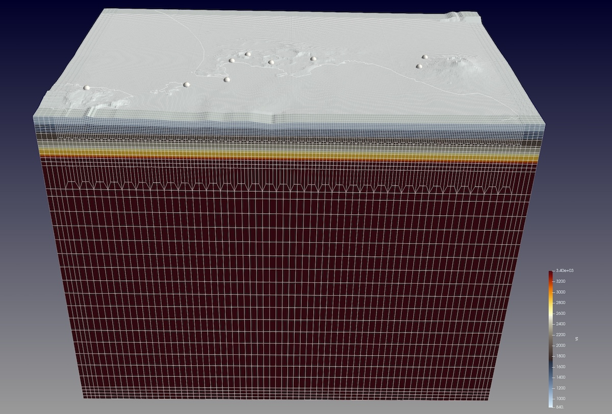
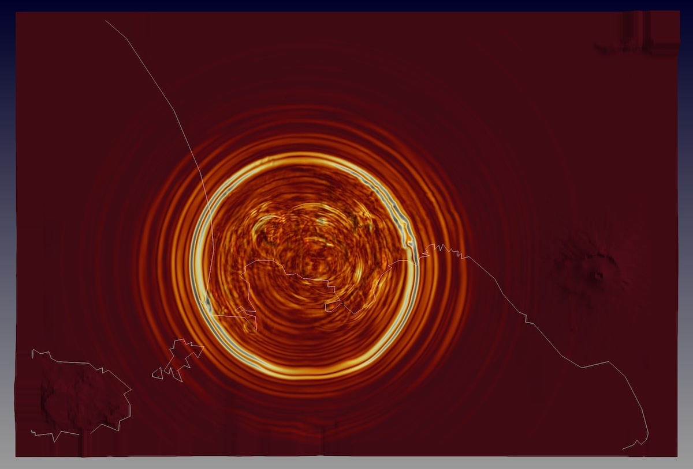

# Campi Flegrei - example with in-house mesher

---



This example downloads topography data for the Campi Flegrei region in Italy
and uses the in-house mesher `xmeshfem3D` for meshing.

Our region of interest:

        Longitude range ~ 13.88 - 14.48
        Latitude          40.7  - 41.0

The simulation setup will be able to accurately model seismic waves up to ~3 Hz.
To set up the mesh parameter files, we're also using scripts provided in the `utils/` folder.

## Step-by-step

The setup requires first to get a realistic topography surface for our region of interest,
and then use this surface together with some internal interfaces definitions
to create an appropriate mesh for the desired simulated seismic waves.

1. Setup topography surface:

  To download the topography data for our region, we can use the python script `run_get_simulation_topography.py` provided
  in the package `SPECFEM3D/utils/scripts/` folder:
  ```
  > ln -s ../../../utils/scripts/run_get_simulation_topography.py
  > ./run_get_simulation_topography.py 13.88 40.70 14.48 41.00 --SRTM=topo3
  ```

  This will download all the needed topography data and create an interface file in folder `./topo_data/`,
  with the main surface topography stored in file `topo_data/ptopo.xyz.1.dat`.
  The script output will also tell in what UTM zone this region lies (`UTM zone: 33N`),
  as well as how the interface definition should look like for the mesher setup
  (`.false. 748 387 13.8699867198 41.0100127551 0.0008300132999998766 -0.000829081599995618`).

  Furthermore, the script automatically updates the setup files `DATA/Par_file`, `DATA/meshfem3D_files/Mesh_Par_file` and `DATA/meshfem3D_files/interfaces.dat` to reflect region, UTM zone and interface definition.


2. Mesher setup:

  We use the previous modifications as initial settings, and then further modify our `DATA/meshfem3D_files/interfaces.dat` file
  to add more internal interfaces at depths between 2 - 6 km to match a 1D velocity model for this region.

  Let's first move and rename the surface topography interface:
  ```
  > mv topo_data/ptopo.xyz.1.dat DATA/meshfem3D_files/interface6.topo.dat
  ```
  and add our internal interfaces to finally have an interfaces definition in `interfaces.dat` like:
  ```
  # number of interfaces
  6
  #
  # SUPPRESS_UTM_PROJECTION  NXI  NETA LONG_MIN   LAT_MIN    SPACING_XI SPACING_ETA
  # interface at 6km depth
  .false. 2 2 13.8699867198 41.0100127551 0.0008300132999998766 -0.000829081599995618
  interface1.dat

  # interface at 5km depth
  .false. 2 2 13.8699867198 41.0100127551 0.0008300132999998766 -0.000829081599995618
  interface2.dat

  # interface at 4km depth
  .false. 2 2 13.8699867198 41.0100127551 0.0008300132999998766 -0.000829081599995618
  interface3.dat

  # interface at 3km depth
  .false. 2 2 13.8699867198 41.0100127551 0.0008300132999998766 -0.000829081599995618
  interface4.dat

  # interface at 2km depth
  .false. 2 2 13.8699867198 41.0100127551 0.0008300132999998766 -0.000829081599995618
  interface5.dat

  # interface (topography, top of the mesh)
  .false. 748 387 13.8699867198 41.0100127551 0.0008300132999998766 -0.000829081599995618
  interface6.topo.dat

  # for each layer, we give the number of spectral elements in the vertical direction
  # up to 6km layer
  17
  # up to 5km layer
  2
  # up to 4km layer
  2
  # up to 3km layer
  2
  # up to 2km layer
  2
  # up to top layer
  10
  ```

  Note that for the internal interfaces we use flat surfaces and thus only need 4 corner points
  all at the same depth to define them. Those interface definitions are thus slightly modified, like using
  ```
  # interface at 6km depth
  .false. 2 2 ..
  ```
  and the rest of the definition with `LONG_MIN`, `LAT_MIN`, etc. can stay the same as for the topography surface.
  For a flat surface, this is good enough and the mesher will recognize it properly also for GLL points outside that range.

  In the main mesher parameter file `DATA/meshfem3D_files/Mesh_Par_file`, we also add two doubling layers
  just below the 6-km and 2-km depth interfaces (that will be layer `17` and `25`, respectively, counting from bottom upwards):
  ```
  # Regular/irregular mesh
  USE_REGULAR_MESH                = .false.
  # Only for irregular meshes, number of doubling layers and their position
  NDOUBLINGS                      = 2
  # NZ_DOUBLING_1 is the parameter to set up if there is only one doubling layer
  # (more doubling entries can be added if needed to match NDOUBLINGS value)
  NZ_DOUBLING_1                   = 17
  NZ_DOUBLING_1                   = 25
  ```

  That's it, all good to go now...


3. Wave simulation:

  To run our simulation, just type:
  ```
  > ./run_this_example.sh
  ```


Well, here are some more notes on details ...

### PML absorbing boundaries

We use the convolutional PML (perfectly matched layer) absorbing boundary for our simulation. To create the PML elements by the in-house mesher, we choose to
extend the mesh by an additional 4-element PML layer. In `DATA/meshfem3D_files/Mesh_Par_file` we thus use:
```
  # CPML perfectly matched absorbing layers
  THICKNESS_OF_X_PML              = 0.02 # with 0.005 deg ~ 550 m
  THICKNESS_OF_Y_PML              = 0.02
  THICKNESS_OF_Z_PML              = 0.02

  # add PML layers as extra outer mesh layers
  ADD_PML_AS_EXTRA_MESH_LAYERS    = .true.
  NUMBER_OF_PML_LAYERS_TO_ADD     = 4
```
With a thickness of `0.02` degrees on the sides and bottom, we obtain a PML width of about `2223.8 m`. Using 4 PML element layers provides a good balance between sampling this PML thickness, the absorption behavior and the associated computational costs.

To stabilize the PML, we find that a reference frequency (f0) of `3 Hz` or higher leads to a stable simulation, thus the corresponding `DATA/Par_file` settings are:
```
  # C-PML boundary conditions for a regional simulation
  # (if set to .false., and STACEY_ABSORBING_CONDITIONS is also set to .false., you get a free surface instead
  # in the case of elastic or viscoelastic mesh elements, and a rigid surface in the case of acoustic (fluid) elements
  PML_CONDITIONS                  = .true.

  # C-PML top surface
  PML_INSTEAD_OF_FREE_SURFACE     = .false.

  # C-PML dominant frequency
  f0_FOR_PML                      = 3.0
```
Choosing good PML settings can be quite tricky, as there are a number of parameters one can play with (see also in the `setup/constants.h`). A thicker and denser sampled PML leads to better results, however at the costs of increased computational time. The main tuning parameters for this example where the PML thicknesses (`THICKNESS_OF_X_PML`,..), the number of PML layers to add (`NUMBER_OF_PML_LAYERS_TO_ADD`) and the reference frequency (`f0_FOR_PML`). The main goal was to achieve a stable simulation for 40'000 time steps, with a decent although not perfect absorbing condition.

## Visualization

For our simulation here, we turned on the surface movie outputs in `DATA/Par_file` like:
```
  # save AVS or OpenDX movies
  # MOVIE_TYPE = 1 to show the top surface
  # MOVIE_TYPE = 2 to show all the external faces of the mesh
  CREATE_SHAKEMAP                 = .false.
  MOVIE_SURFACE                   = .true.
  MOVIE_TYPE                      = 2
  MOVIE_VOLUME                    = .false.
  SAVE_DISPLACEMENT               = .false.
  MOVIE_VOLUME_STRESS             = .false.
  USE_HIGHRES_FOR_MOVIES          = .true.
  NTSTEP_BETWEEN_FRAMES           = 500
  HDUR_MOVIE                      = 0.0
```



To visualize the corresponding output data (`OUTPUT_FILES/moviedata***`), we can render surface movie files as `OUTPUT_FILES/AVS_*.inp` files:
```
> ./xcreate_movie_files.sh
```

You can use for example [Paraview](https://www.paraview.org) to look at these *.inp files.


## VS30 surface data (optional)

USGS provides a global [Vs30 model and data](https://earthquake.usgs.gov/data/vs30/) set.
We can download and extract a corresponding Vs30-interface for our region:

```
> ln -s ../../../utils/scripts/run_get_simulation_USGS_Vs30.py
> mkdir -p USGS_VS30
> ./run_get_simulation_USGS_Vs30.py 13.87 40.69 14.49 41.01
```
This will create an interface file `./USGS_VS30/interface_vs30.dat`.

Note that we use a slightly extended region to make sure all the mesh points will find corresponding Vs30 interface values. (This is a technical detail: the mesher converts the lon/lat coordinates of the corner points specified in `Mesh_Par_file` to UTM coordinates and determines the minimum/maximum UTM coordinate values. The latter will be used for the mesh grid points creation. Due to the UTM zone distortion, this can lead to grid points that if we would convert their coordinates back to geographic coordinates, are slightly beyond the minimum/maximum longitude and latitude range as specified in `Mesh_Par_file`).

In case we want the meshing to be aware of this Vs30 interface
and incorporate the Vs values for the top 30m GLL points, we can move it to our `DATA/` folder:
```
> mv ./USGS_VS30/interface_vs30.dat DATA/
```
The `xgenerate_databases` binary will check if this file is found in `DATA/` and if so, will use the corresponding interface data
to over-impose the Vs values on the corresponding grid nodes.
To avoid creating artificial rock properties, it will also scale Vp and density accordingly for crustal rocks (Brocher 2005, *Empirical Relations between Elastic Wavespeeds and Density in the Earth's Crust*, BSSA).

Note:

    Using Vs30 velocities requires a very high-resolution mesh at the top,
    otherwise these low velocities will "smear down" to deeper depths because of the
    GLL interpolation within the spectral elements.

Regarding meshing for high resolutions, here are some further notes to consider:

* USGS Vs30 - with a 30-m thickness layer:

  In principle, we would want an element with 30 m thickness at the top for these Vs30 values.
  The element below then would resort to the background model velocities. This would create a "sharp" model interface.
  Unfortunately, this will also create a tiny time step size for the whole simulation (unless we would use the local-time stepping feature `LTS_MODE` in `DATA/Par_file` to circumvent this global time step size restriction).

  Could we use a larger top element and have a somewhat "smoother" transition from Vs30 values to background velocities?

  Let's consider a 30 m layer thickness, covered by 2 GLL points:
  - minimum GLL point distance:
          dx = 0.1726     for NGLL == 5
          dx = 0.0641299  for NGLL == 8

   This leads to -> `30 m / dx = 174 m` for NGLL == 5.

  Thus, add an interface of ~ 174 m depth to have a top element layer thickness such that 30 m velocities can be sampled by 2 GLL points.

  To create such an interface for element sizes with 174m thickness, scale down the surface topography accordingly:
  ```
  > awk '{printf("%.6f\n",$1-174.0);}' topo_data/ptopo.xyz.1.dat > ./topo_data/ptopo.xyz.2.174m.dat
  ```

  However, having a second GLL point at exactly 30 m will still assign a Vs30 velocity to that point.
  The interpolation within the element will thus further smear down the low velocity to the mid point
  (at 87 m for a 174-m element thickness).

  How about using a top element depth of ~ 500 m?

      second GLL point at depth 500 m * 0.1726 = 86.3 m

  The interpolation between first and second GLL point will thus make the Vs30 layer slightly deeper than 30 m,
  but will transition to (bedrock) background model properties at ~ 86 m.
  This is similar as for the 174-m element case, but Vs30 here gets sampled in depth by only a single GLL point on top.
  Still, a 500-m element thickness will further help with the time step size issue and avoid the "smearing down" of very low velocities
  to deeper depths.

  Well, give it try if you want ...


## Reference solution

For comparison, we provide a reference solution in folder `REF_SEIS/` with corresponding output files. The simulation was run in parallel using 16 MPI processes, each using a single Nvidia A100 GPU. The total simulated time is 40 s with a time-to-solution of ~3 min.
