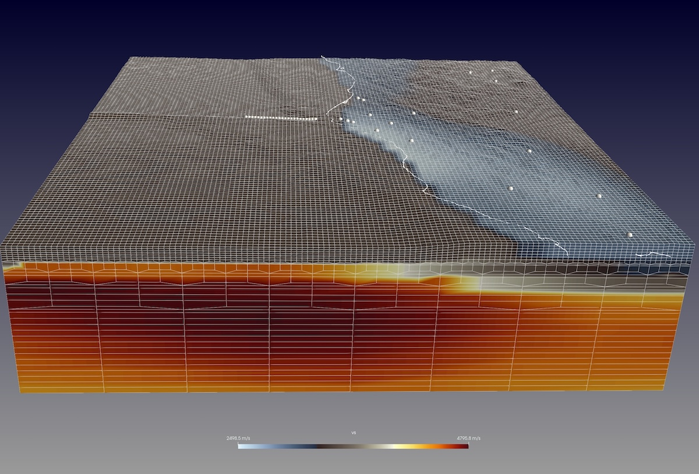
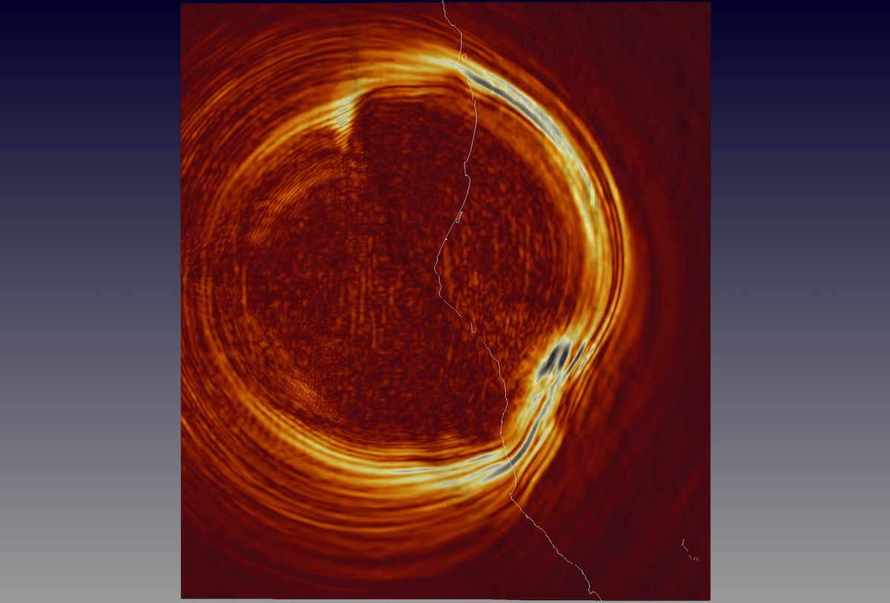
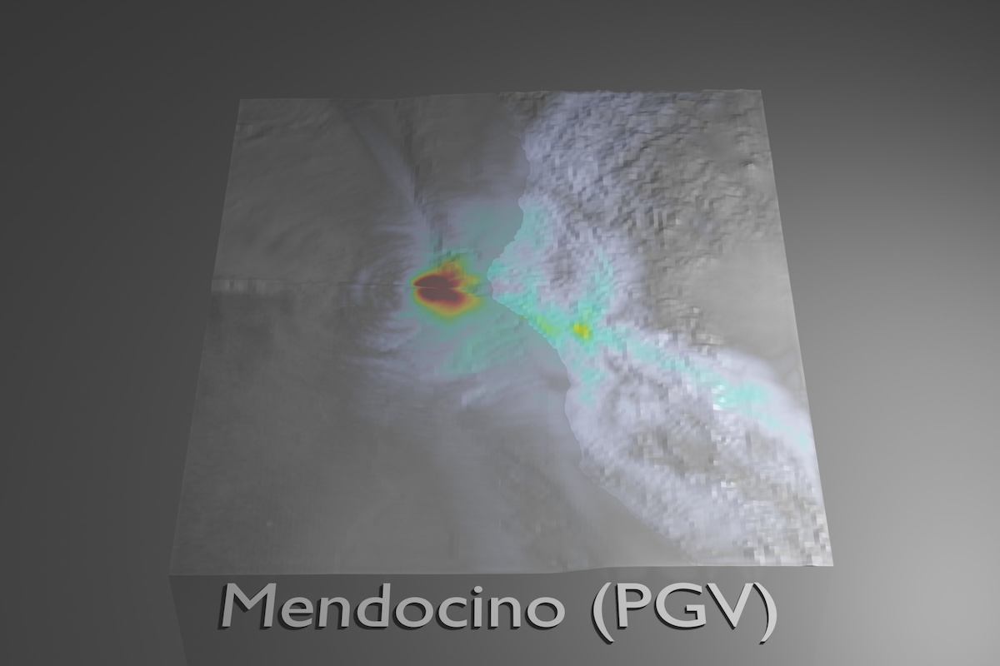

# 2024 Cape Mendocino Mw 7.0 earthquake - shakeMovie visualization

---



This example will setup a model with the in-house mesher to simulate the
2024 Cape Mendocino earthquake using the USGS finite-fault solution.

About the event:
* The Mendocino earthquake happened 2024-12-05 18:44:21 UTC with an estimated moment magnitude Mw 7.0.
  The USGS provides the following event page about the earthquake:
  [2024 Mendocino Mw7.0 earthquake](https://earthquake.usgs.gov/earthquakes/eventpage/nc75095651/executive)

  We will use the derived finite-fault solution of this event, provided on this detail page:
  [Mendocino Mw7.0 finite-fault solution](https://earthquake.usgs.gov/earthquakes/eventpage/nc75095651/finite-fault?source=us&code=nc75095651_1)

  To download this USGS finite-fault solution in a CMT-format for our SPECFEM3D example, you can get it into the `DATA/` folder by:
  ```
  > cd ./DATA/
  > wget https://earthquake.usgs.gov/product/finite-fault/nc75095651_1/us/1733529167722/CMTSOLUTION
  ```

Given the size of this earthquake and its wide-spread affected area, we will use a lon/lat range of about 4 x 4 degrees.

Our region of interest:

        Longitude range ~ -126.5  to  -122.0
        Latitude            38.2  to    42.2


## Step-by-step

We'll setup first the surface topography of this region, together with an internal interface to build a spectral-element mesh.
Our intention here is to run a simulation for creating a shakeMovie visualization, thus the focus is on creating a rather simple mesh.
However, you can use this as a starting point to build your own, more detailed and sophisticated, meshes.

Furthermore, we want to use a (realistic) velocity model for this region.
We will take one of the EarthScope (IRIS) [EMC models](https://ds.iris.edu/ds/products/emc-earthmodels/).
For this region, a nice model seems to be [WUS256](https://ds.iris.edu/ds/products/emc-wus256/) by Rodgers et al. (2022).


1. **Setup model**:

  We will first setup the topography surface and tomographic model for meshing our region.
  In this example folder, we provide a bash script `setup_model.sh` to setup these model files.

  Just run the setup script with the target region:
  ```
  > ./setup_model.sh -126.5 -122.0 38.2 42.2
  ```

  This might take a while to complete...

  There are mainly two steps executed:
  * Topography data: it will use the script `utils/scripts/run_get_simulation_topography.py` to download all the needed topography data and create an interface file in folder `./topo_data/`,
  with the main surface topography stored in file `topo_data/ptopo.xyz.1.dat`.
  The script determines in what UTM zone this region lies,
  as well as how the interface definition should look like for the mesher setup.
  It then automatically updates the setup files `DATA/Par_file`, `DATA/meshfem3D_files/Mesh_Par_file` and `DATA/meshfem3D_files/interfaces.dat` to reflect region, UTM zone and interface definition.

  * Velocity model: it will download the EMC model into a folder `IRIS_EMC/`
  and create the tomography model for our region using the script `utils/scripts/run_convert_IRIS_EMC_netCDF_2_tomo.py`. The tomography model file `tomography_model.xyz` will be put into folder `DATA/tomo_files/`.

  Note that for meshing, we use a second, shifted internal interface to make it easier to use doubling layers. These doubling layers help coarsening the mesh with depth. This way, we will have a mesh that is mostly refined at the top to capture surface waves (which is what we are mostly interested in for visualizing the shaking). The mesher parameter file `DATA/meshfem3D_files/Mesh_Par_file` is setup accordingly to include these doubling layers, working together with the `DATA/meshfem3D_files/interfaces.dat` file which defines the surface and internal interface and number of element layers with depth.


2. **Wave simulation**:

  After you have completed the mesh setup, you can run the in-house mesher `xmeshfem3D` and `xgenerate_databases` to create the spectral-element mesh of our region.
  The seismic wave propagation solver `xspecfem3D` then creates the needed movie data files for our visualization.

  To run the simulation, just type:
  ```
  > ./run_this_example.sh
  ```


3. **Visualization**:

  For our simulation here, we turned on the surface movie and shake map outputs in `DATA/Par_file` like:
  ```
  # save AVS or OpenDX movies
  # MOVIE_TYPE = 1 to show the top surface
  # MOVIE_TYPE = 2 to show all the external faces of the mesh
  CREATE_SHAKEMAP                 = .true.
  MOVIE_SURFACE                   = .true.
  MOVIE_TYPE                      = 2
  MOVIE_VOLUME                    = .false.
  SAVE_DISPLACEMENT               = .false.
  MOVIE_VOLUME_STRESS             = .false.
  USE_HIGHRES_FOR_MOVIES          = .true.
  NTSTEP_BETWEEN_FRAMES           = 100
  HDUR_MOVIE                      = 0.0
  ```

  

  To visualize the corresponding output data (`OUTPUT_FILES/moviedata***`), we can create movie snapshot files as `OUTPUT_FILES/AVS_*.inp` files:
  ```
  > ./xcreate_movie_files.sh
  ```

  Similar for the shake map, we can plot the peak-ground velocity (PGV) values by
  ```
  > ./xcreate_shakemap.sh 2
  ```

  You can use for example [Paraview](https://www.paraview.org) to look at these *.inp files.


That's it, time for you to play! Here below are some more details to try out...

## VS30 surface data (optional)

USGS provides a global [Vs30 model and data](https://earthquake.usgs.gov/data/vs30/) set.
We can download and extract a corresponding Vs30-interface for our region:

```
> ln -s ../../../utils/scripts/run_get_simulation_USGS_Vs30.py
> mkdir -p USGS_VS30
> ./run_get_simulation_USGS_Vs30.py -126.8 38.1 -121.9 42.3
```
This will create an interface file `./USGS_VS30/interface_vs30.dat`.

Note that we use a slightly extended region to make sure all the mesh points will find corresponding Vs30 interface values. (This is a technical detail: the mesher converts the lon/lat coordinates of the corner points specified in `Mesh_Par_file` to UTM coordinates and determines the minimum/maximum UTM coordinate values. The latter will be used for the mesh grid points creation. Due to the UTM zone distortion, this can lead to grid points that if we would convert their coordinates back to geographic coordinates, are slightly beyond the minimum/maximum longitude and latitude range as specified in `Mesh_Par_file`).

In case we want the meshing to be aware of this Vs30 interface
and incorporate the Vs values for the top 30m GLL points, we can move it to our `DATA/` folder:
```
> mv ./USGS_VS30/interface_vs30.dat DATA/
```
The `xgenerate_databases` binary will check if this file is found in `DATA/` and if so, will use the corresponding interface data
to over-impose the Vs values on the corresponding grid nodes.
To avoid creating artificial rock properties, it will also scale Vp and density accordingly for crustal rocks (Brocher 2005, *Empirical Relations between Elastic Wavespeeds and Density in the Earth's Crust*, BSSA).

Note:

    Using Vs30 velocities requires a very high-resolution mesh at the top,
    otherwise these low velocities will "smear down" to deeper depths because of the
    GLL interpolation within the spectral elements.


Regarding meshing for high resolutions, here are some further notes to consider:

* USGS Vs30 - with a 30-m thickness layer:

  In principle, we would want an element with 30 m thickness at the top for these Vs30 values.
  The element below then would resort to the background model velocities. This would create a "sharp" model interface.
  Unfortunately, this will also create a tiny time step size for the whole simulation (unless we would use the local-time stepping feature `LTS_MODE` in `DATA/Par_file` to circumvent this global time step size restriction).

  Could we use a larger top element and have a somewhat "smoother" transition from Vs30 values to background velocities?

  The minimum GLL point distance within a spectral element depends on the order of the element, i.e., for a 4th-order element (NGLL == 5) the minimum distance is given by `d_min = dx * element_size` with the factor `dx = 0.1726` for `NGLL == 5`.

  For example, having an element size of 500 m leads to a minimum GLL point distance of `dx * 500 m = 86.3 m` for NGLL == 5. That is, the velocity profile sampled within the top element assigns the Vs30 velocity to the uppermost GLL point and then resorts back to the background model velocity for the second GLL point at a depth of 86.3 m.

  To create such mesh elements at the top, an interface for element sizes with 500-m thickness can be constructed by scaling down the surface topography interface accordingly:
  ```
  > awk '{printf("%.6f\n",$1-500.0);}' topo_data/ptopo.xyz.1.dat > ./DATA/meshfem3D_files/ptopo.xyz.500m.dat
  ```
  This interface can be added to the `DATA/meshfem3D_files/interfaces.dat` file and assign a single element layer between this 500-m interface and the top (topography) surface.

  To give it a try, a corresponding `interfaces.vs30.dat` file is provided in folder `DATA/meshfem3D_files/`. You could replace the default `interfaces.dat` file with this one. However, you will also need to decrease the time step size `DT` in the main parameter file `DATA/Par_file` before re-running the simulation for comparison.

## Blender visualization



Once created, the shakeMap file `OUTPUT_FILES/AVS_shaking_map.inp` can also be visualized with [Blender](https://www.blender.org), a rather professional 3D visualization software. To make things easy, we have some python scripts in folder `utils/Visualization/Blender/python_blender/` to help render images.

With Blender installed on your system, you could try:
```
> ln -s ../../../utils/Visualization/Blender/python_blender/plot_with_blender.py
> ./plot_with_blender.py --vtk_file=OUTPUT_FILES/AVS_shaking_map.inp --title="Mendocino (PGV)" --color-max=0.25 --transparent-sea-level --background-dark --vertical-exaggeration=2.0
```

## Reference solution

For comparison, we provide a reference solution in folder `REF_SEIS/` with corresponding output files.
The simulation was run in parallel using 16 MPI processes, each using a single Nvidia A100 GPU. The total simulated time is 140 s with a time-to-solution of ~2 min.
