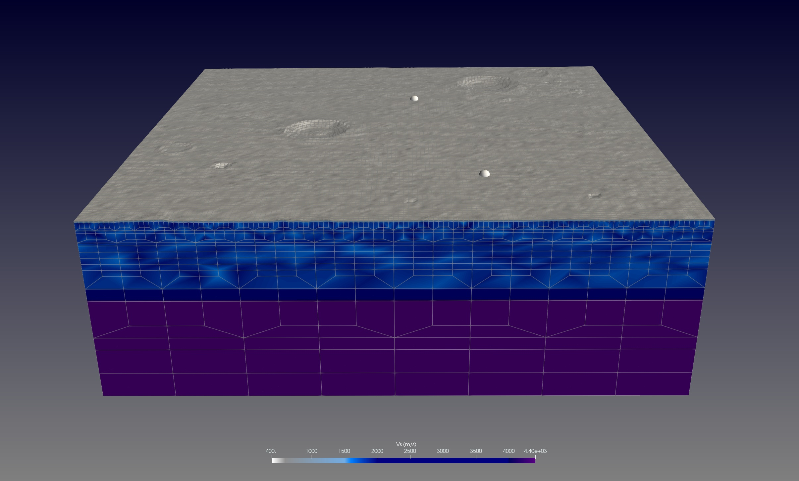

# Apollo 16 booster impact

---



This is a simple example for a Moon simulation. It takes the lunar topography and sets up a model
around the Apollo 16 booster impact and the seismic station installed by Apollo 12.

The Apollo 16 S-IVB booster impact (Onodera et al. 2022; Wagner et al. 2017) details are:
* time of impact approximately on April 19, 1972, 21:02:04 (UTC)
* location is at lat = 1.9210, lon = 335.3770  (deg)
* impact angle specified by angle from horizon:  79, heading angle (NE): 255.3 (deg)
* relatively low impact speed v ~ 2.6 km/s, and assumed booster mass (stage at impact) m ~ 13,973 kg
* momentum p = m * v ~ 3.6 * 10^7 [kg m/s], with an estimated deceleration time dt ~ 0.1 s,
  leads to an average force F = p / dt ~ 3.6 * 10^8 [N]


Moon stations:
  ```
  S12        XA        -3.01084     -23.42456       0.0    0.0      # Apollo 12
  S14        XA        -3.64450     -17.47753       0.0    0.0
  S15        XA        26.13407       3.62981       0.0    0.0
  S16        XA        -8.97577      15.49649       0.0    0.0
  ```

For meshing, we use a Moho interface at an estimated 30.8 km depth (at Apollo 12 landing site) and a 3-layer model.
The top, middle and bottom layers have regolith, crustal and mantle rock properties respectively.
The values are taken from Garcia et al. (2011) VPREMOON model.

----

## Setup

The setup of the model is meant for a low-resolution movie simulation that runs on 8 CPU-cores.
The mesh is build for the region around the booster impact and the Apollo 12 seismic station,
an area from longitude -30 to -20 degrees, latitude from -5 to 5 degrees.

The setup is done by the following steps:

* **Step 1:** Mesh setup

  We will use the in-house mesher `xmeshfem3D` to create our simulation mesh. The main files in `DATA/meshfem3D_files/Mesh_Par_file`
  and `interfaces.dat` are setup such that we will have 3 layers, where the Moho surface at 30.8 km depth is added manually by
  creating a flat interface file `interface.moho.dat`.

  To facilitate the meshing with doubling-layers, we also add an additional intermediate flat interface at 8 km depth from where the mesh
  will start the stretching to account for the topography. This avoids issues with elements having negative Jacobians due to the stretching
  and doubling of the mesh element sizes.

  In `interfaces.dat`, we also added two more entries for the surfaces `ptopo.xyz.*.dat` that will be created and modified accordingly in the next step.


* **Step 2:** Topography

  To create the mesh topographic surface of the Moon, we do:
  ```
  > cd EXAMPLES/real_world/Moon_Apollo_impact
  > ln -s ../../../utils/scripts/run_get_simulation_topography.py
  ```
  and then
  ```
  > ./run_get_simulation_topography.py -30 -5 -20 5 --SRTM=moon --toposhift=1000.0 --toposcale=0.9
  ```

  This script creates the files needed in a subfolder `topo_data/`, in particular the topography surface (`ptopo.xyz.1.dat`) and
  a down-shifted surface (`ptopo.xyz.2.dat`, by approximately 1 km and a slight down-scaling of the topography by factor `0.9`)
  to defined our regolith elements within this layer.

  The script also modified the entries in the `interfaces.dat` to read the correct number of entries and increments.
  It also modifies `Mesh_Par_file` to set the correct mesh lat/lon-dimensions and lunar projection zone number (as the `UTM_PROJECTION_ZONE`).

> [!NOTE] 
> For Moon simulations, instead of the Universal Transverse Mercator (UTM) projection valid for Earth, the mesher will use a Lunar Transverse Mercator (LTM) projection (for latitudes between [-82,82] degrees) or a Lunar Polar Stereographic (LPS) at North/South pole regions. To enable these lunar projections, use a model name starting with `moon_***` (see `moon_default` in `Par_file`; or use `moon_tomo` for combining it with a tomography model).
>
> The zone numbers are positive for the Northern hemisphere and negative for Southern hemisphere. LTM uses zone numbers in the range +/- [1,45], LPS uses 46 for North pole and -46 for South pole regions. The script `run_get_simulation_topography.py` will output the corresponding zone number for the specified area (using its midpoint to determine the zone).


* **Step 3:** source and station

  The station "S12" added in `DATA/STATIONS` is the Apollo 12 seismic station at location lat/lon = (-3.01084, -23.42456) (deg).
  For the Apollo 16 S-IVB booster impact, we use a point force `DATA/FORCESOLUTION` at location lat/lon = (1.9210, 335.3770) (deg).
  The source time function is a Gaussian with a force factor and direction estimated by the informations given above.


For convenience, this example folder has all these required setup files to run directly the wave simulation.

---

## Scattering perturbations

For this moon model, we will add random 3D scattering perturbations with a von Karman distribution in the regolith and crustal layers. The following entries can be added in the `DATA/Par_file` to add such perturbations:
```
## scattering
# adds scattering perturbations to velocity model
SCATTERING_PERTURBATIONS        = .true.
# perturbation strength
SCATTERING_STRENGTH             = 0.4d0
# correlation factor
SCATTERING_CORRELATION          = 5.d0
# list of material ids to apply scattering perturbations (0 == for all materials)
SCATTERING_MATERIAL_IDS         = 2,3
```
Here we chose some arbitrary values just to visualize its effect. The settings will create perturbations with a strength of 40% and a von Karman correlation factor 5.0 that leads to an approximated correlation length of ~664 m (see output in `OUTPUT_FILES/output_generate_databases.txt`). The material IDs "2,3" are depicting the crustal and regolith material layers defined in the mesh by `Mesh_Par_file`.


----

## Wave simulation:

  To run our simulation, just type:
  ```
  > ./run_this_example.sh
  ```

  The simulation is meant as a movie simulation. To suppress numerical noise for a cleaner movie visualization, we enlarged the source half-duration
  by `HDUR_MOVIE = 5.0` in the `Par_file`.

  The solver will create binary movie files in `OUTPUT_FILES/` folder. To convert them to VTK-files that can be visualized e.g. with Paraview,
  we run the script:
  ```
  > ./xcreate_movie_files.sh
  ```


