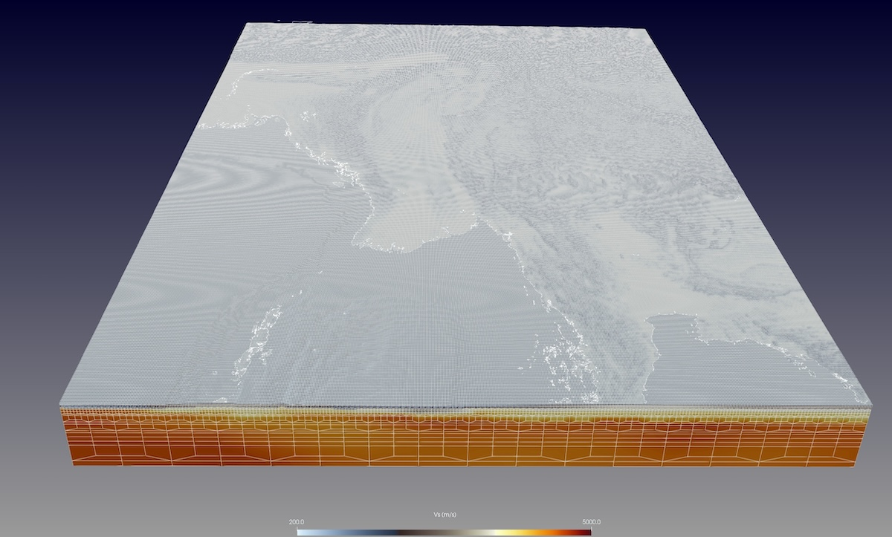
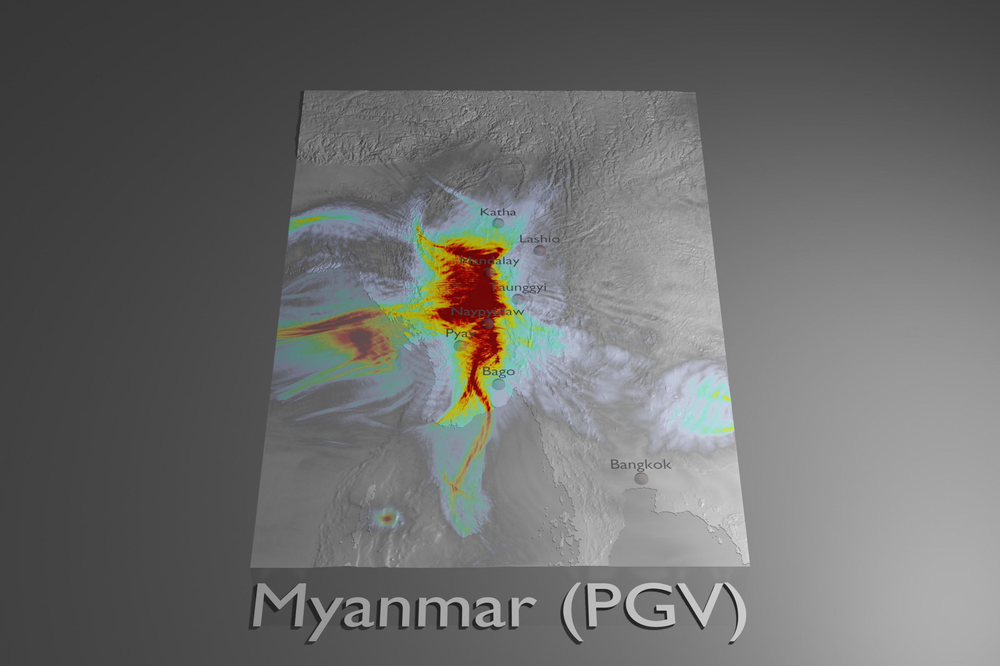
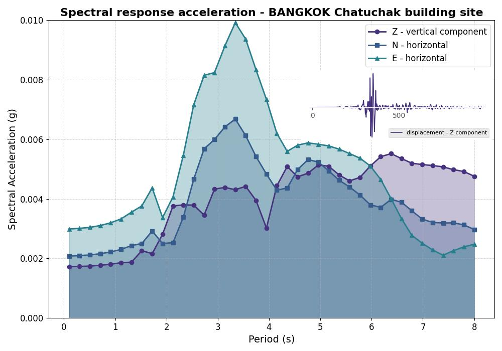

# 2025 Myanmar Mw7.7 earthquake

---




This examples sets up a model with the in-house mesher `xmeshfem3D` to simulate the 2025 Myanmar earthquake. The mesh is built for a rather large region around Myanmar (Burma) and extends until Bangkok, Thailand, in the South.

About the event:
* The Myanmar earthquake happened on 2025-03-28 06:20:52 (UTC) with an estimated magnitude Mw 7.7. The USGS provides the following event page about the earthquake:
  [2025 Myanmar Mw7.7 earthquake](https://earthquake.usgs.gov/earthquakes/eventpage/us7000pn9s/executive)

  The epicenter was located about 16 km NNW of Sagaing, Myanmar, with lat/lon position (21.6972 / 95.8950).
  We will use the derived finite-fault solution of this event, provided on this detail page:
  [Myanmar Mw7.7 finite-fault solution](https://earthquake.usgs.gov/earthquakes/eventpage/us7000pn9s/finite-fault)

  To download this USGS finite-fault solution in a CMT-format for our SPECFEM3D example, you can get it into the `DATA/` folder by:
  ```
  > cd ./DATA/
  > wget https://earthquake.usgs.gov/product/finite-fault/us7000pn9s_1/us/1743603597922/CMTSOLUTION
  ```

Given the size of this earthquake and its wide-spread affected area, we will use a lon/lat range of about 14 x 20 degrees.

Our region of interest:

        Longitude range ~   89.9 to 103.9
        Latitude            10.7 to 30.7


Since we are also interested in the shaking at the Bangkok Chatuchak building collapse, we add that location (13.802 N, 100.547 E) as a station site to the `DATA/STATIONS` file.

The model setup is kept fairly simple, yet it is computationally quite challenging already. For example, the simulation takes ~25 minutes on 16 GPUs (Nvidia A100).


## Step-by-step

We'll first need to setup the surface topography of this region, together with internal interfaces to build a spectral-element mesh.
Our intention here is to run a simulation for creating a shakeMovie visualization, thus the focus is on creating a rather simple mesh.
However, you can use this as a starting point to build your own, more detailed and sophisticated, meshes.

Furthermore, we want to use a (realistic) velocity model for this region.
We will take one of the EarthScope (IRIS) [EMC models](https://ds.iris.edu/ds/products/emc-earthmodels/).
For this region, a nice model seems to be [FWEA23](https://ds.iris.edu/ds/products/emc-fwea23/) by Liu et al. (2024).


1. **Setup model**:

  We will first setup the topography surface and tomographic model for meshing our region.
  In this example folder, we provide a bash script `setup_model.sh` to setup these model files.

  Just run the setup script with the default target region:
  ```
  > ./setup_model.sh
  ```

  This might take a while to complete and download the rather large EMC model file.
  Note that we added additional interfaces at 100km and 6km depth to facilitate the meshing with doubling layers.

  Furthermore, USGS provides a global [Vs30 model and data](https://earthquake.usgs.gov/data/vs30/) set.
  The script will download and extract a corresponding Vs30-interface for our region.


2. **Wave simulation**:

  After you have completed the mesh setup, you can run the in-house mesher `xmeshfem3D` and `xgenerate_databases` to create the spectral-element mesh of our region.
  The seismic wave propagation solver `xspecfem3D` then creates the needed movie data files for our visualization.

  To run the simulation, just type:
  ```
  > ./run_this_example.sh
  ```


  3. **Visualization**:

    For our simulation here, we turned on the surface movie and shake map outputs in `DATA/Par_file` like:
    ```
    # save AVS or OpenDX movies
    # MOVIE_TYPE = 1 to show the top surface
    # MOVIE_TYPE = 2 to show all the external faces of the mesh
    CREATE_SHAKEMAP                 = .true.
    MOVIE_SURFACE                   = .true.
    MOVIE_TYPE                      = 2
    MOVIE_VOLUME                    = .false.
    SAVE_DISPLACEMENT               = .false.
    MOVIE_VOLUME_STRESS             = .false.
    USE_HIGHRES_FOR_MOVIES          = .true.
    NTSTEP_BETWEEN_FRAMES           = 100
    HDUR_MOVIE                      = 0.0
    ```

    To visualize the corresponding output data (`OUTPUT_FILES/moviedata***`), we can create movie snapshot files as `OUTPUT_FILES/AVS_*.inp` files:
    ```
    > ./xcreate_movie_files.sh
    ```

    Similar for the shakemap, we can plot the peak-ground velocity (PGV) values by
    ```
    > ./xcreate_shakemap.sh 2
    ```

    You can use for example [Paraview](https://www.paraview.org) to look at the created `OUTPUT_FILEs/AVS_movie*.inp` files.


  That's it, try it out for yourself...


## Visualization with Blender (optional)


A single wavefield snapshot like above can be plotted using [Blender](https://www.blender.org) with:
```
> ./xcreate_snapshot.sh 10000
```


Regarding shakemap image coloring, for conversion to Modified Mercalli Intensity (MMI), Wald et al. suggest a table like:

| PGV (cm/s)           | < 0.1 | 0.1-0.4 | 0.4-1.1 | 1.1-3.4 | 3.4-8.1 | 8.1-16.0 | 16.0-31.0 | 31.0-60.0 | 60.0-116.0 | > 116.0 |
| - | - | - | - | - | - | - | - | - | - | - |
| Intensity (MMI)      |  I      |  II     |  III      |  IV    |    V       |  VI       |   VII     |   VIII    |     IX    |       X+ |


USGS uses a scale like:

| PGV (cm/s)          | < 0.0215 | 0.135 | 1.41 | 4.65 | 9.64 | 20  | 41.4 | 85.8 | >178 |
| - | - | - | - | - | - | - | - | - | - |
| Intensity            |    I    |  II-III |  IV    |  V   |  VI  |  VII |  VIII   | IX  |   X+ |


The PGV maximum value of this simulation is ~ 26.1 m/s. To cut the maximum color at intensity VIII:
  ```
  0.096 m/s == 9.64 cm/s   that is up to intensity ~  VI
  0.2       == 20   cm/s   that is up to intensity ~  VII
  0.414     == 41.4 cm/s   that is up to intensity ~  VIII
  ```

Adjust color-max accordingly:
```
> ./plot_with_blender.py --vtk_file=OUTPUT_FILES/AVS_shaking_map.inp \
--title="Myanmar (PGV)" --color-max=0.414 \
--transparent-sea-level --background-dark \
--locations=DATA/interesting_locations.dat --utm_zone=47 \
--sea-level-separation=0.001 --vertical-exaggeration=2.0
```



## Spectral Acceleration (SA) - response spectrum at Bangkok Chatuchak building collapse

Our simulation outputs the ground motions at the Chatuchak building site in Bangkok, Thailand. In particular, we are interested in how the [Spectral Acceleration (SA)](https://en.wikipedia.org/wiki/Spectral_acceleration) for a building at this location looked like.

After running the simulation, we obtain the ground motion accelerations as `OUTPUT_FILES/DB.BANGKOK.BX*.sema` for N/E/Z directions. To plot the spectral acceleration response spectrum for these accelerations, we following this example on [Ground motions for engineering](https://github.com/danielpeter/teaching-seismic-waves/tree/master/11_Ground_motions_for_engineering).



A simple script to produce this figure is provided in this example directory:
```
> ./xcreate_spectral_response.sh
```

## Sonification of traces (optional)

  To hear how the ground shaking sounded, we can "sonify" the output traces, i.e., map the traces to an audible spectrum.
  First, get the script from the [shakemovie](https://github.com/SPECFEM/shakemovie) repository:
  ```
  > git clone https://github.com/SPECFEM/shakemovie.git
  > ln -s shakemovie/scripts/run_create_sound.py
  ```

  and create sounds:
  ```
  > ./run_create_sound.py 1.0 OUTPUT_FILES/DB.MANDALAY.BXZ.semv 25.0
  > ./run_create_sound.py 1.0 OUTPUT_FILES/DB.NAYPYIDAW.BXZ.semv 25.0
  ```

  ## Reference solution

  For comparison, we provide a reference solution in folder `REF_SEIS/` with corresponding output files.
  The simulation was run in parallel using 16 MPI processes, each using a single Nvidia A100 GPU. The total simulated time is 1000 s with a time-to-solution of ~ 24 min 15 s.
